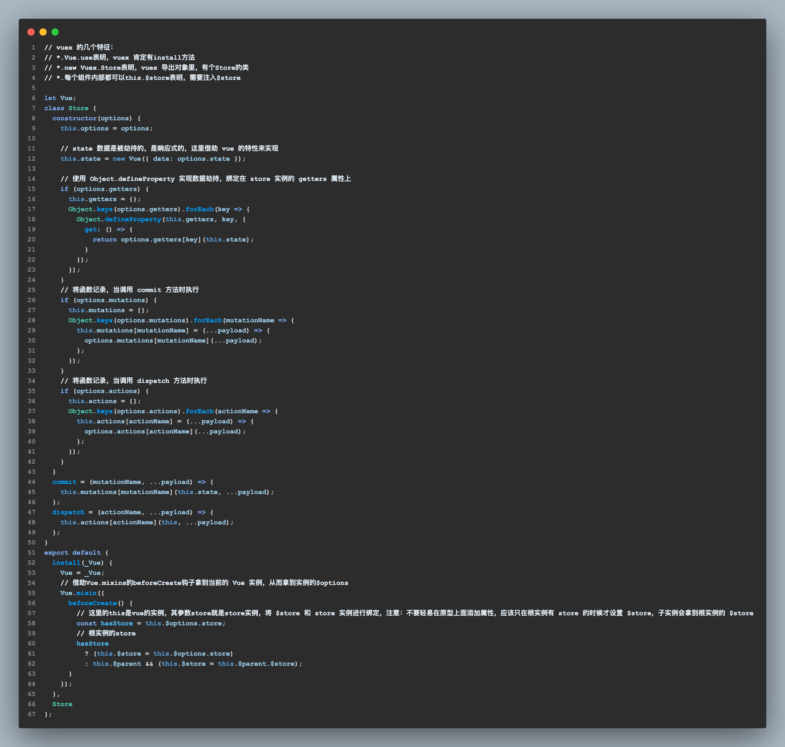

# projects-for-2023

> ***some projects i did during 2023' learning process***

## project1: 使用纯css和html实现百度页面仿写

- **记录一些要点**
- 目的：使用 html 和 css 实现一个百度页面仿写的程序
- 分析：页面较简洁，各个部分的内容教集中，但是细节问题较多。
- 思路：分部分实现，首先使用语意化标签nav，main，aside，footer等进行划分，然后针对每一小部分进行实现
- 布局方面主要使用flex布局进行设计，包括横向的布局以及纵向的布局，包括多栏布局，例如更多btn的隐藏子级菜单设计
- 隐藏布局使用visibility属性来实现，这个属性与类似display，会保留元素原来的位置，但是不会触发事件。主要的技术点在于设置同级元素悬浮hover伪类属性时将隐藏元素的visibility属性设置为visiable，并且其hover伪类属性里也需要设置，这样就可以让隐藏元素持续显示
- icon引入使用svg标签的方法，可以设置fill属性进行颜色改变，相对来说较方便
- 这个页面的hover效果较多，针对不同的组件之间的共同hover属性可以使用同一类来定义，提取共同点可以让这个过程更加简洁也更加规范，可读性更高

## project2：使用开放api搭建天气查询页面

- **记录一些要点**
- 目的：使用 axios 访问公开接口查询对应地点的天气情况
- 分析：使用axios发起HTTP GET请求，并将返回的数据解析为需要的天气信息，以日期为分割显示在信息展示区内
- 布局上使用flex：1这个属性设置中间一栏，左右两栏设置固定宽度，并且相比父元素为absolute定位，可以将左右两栏分别固定在左右两端，中间一栏可以自适应宽度，将扩充所有剩余的空间，保持三栏
- axios发起GET请求，设置头部信息content-type，application/x-www-form-urlencoded是浏览器默认的编码格式。对于Get请求，是将参数转换?key=value&key=value格式，连接到url后
- 根据该api提供的返回数据进行解析，使用对象解构方式将关于特定日期天气信息解析出来，然后在对应的html展示区内进行写入，使用innerHTML属性进行写入，以模板字符串的形式插入天气信息
- 注意：当前并没有针对input框的输入内容进行过滤，而是根据返回数据的内容进行判断，如果内容为空则无内容显示。为了防止潜入代码攻击，最好是在客户端对传输的内容进行过滤。

## project3：使用 vue3 的实践案例

- **不同小案例的要点详见文件夹下的README.md**

## project4：vue3 的 transition 过渡组件的使用实例

- **记录一些要点**
- 目的：使用 vue3 transition 过渡组件 完成一些动画制作
- 内容一：使用 transition-group 组件设置数组元素新增/减少的动画
- 内容二：使用 transition-group 组件的位移属性设置元素相对位移的动画，注意，每个元素的 key 必须绑定一个静态的值
- 内容三：结合 animate.css 完成一个时钟动画效果，当其内容发生变化时触发动画
- 预览链接：<https://shawnonthemove.github.io/projects-for-2023/pro-four-vue-animate//dist/index.html>
- 主要原理：

> 在Vue3中，transition 组件是一个用于在元素插入/更新/移除时应用过渡效果的抽象组件。当添加、更新或删除渲染的元素时，transition 组件会自动检测元素的可见性，并触发相应的 CSS 过渡类名。这些类名可以用来实现各种动画效果。其原理基本上是通过 Vue 对元素进行添加、更新和删除操作时使用钩子函数，在元素状态变化之前和之后添加对应的类名，以便应用 CSS 过渡效果。
具体来说，会使用以下钩子函数，这些钩子函数允许在不同的 生命周期 阶段添加或删除类名，以触发 CSS 过渡效果，transition 组件是通过监听元素状态的变化，并在状态变化时应用 CSS 类名来实现过渡效果的。

    1. beforeEnter
    2. enter
    3. afterEnter
    4. enterCancelled
    5. beforeLeave
    6. leave
    7. afterLeave
    8. leaveCancelled

## project5：vue3 的 v-model 指令

- **记录一些要点**
- 目的：使用 vue3 v-model 绑定自定义组件，并根据原理实现一个 v-model 自定义指令
- 预览链接：<https://shawnonthemove.github.io/projects-for-2023/pro-five-vue-state/dist/index.html>
- 主要原理：v-model本质上就是语法糖，它将表单元素的 value 属性和 input 事件以及组件的 value 属性和 update:modelValue 事件进行了绑定，实现了双向数据流。具体来说，当我们使用 v-model 绑定一个表单元素或组件时，Vue.js 会自动生成一个新的名为 modelValue 的 prop（value 也可以通过 model-value 属性指定），同时在表单元素上监听 input 事件，或者在组件上监听 update:modelValue 事件。当用户对表单进行输入改动时，input 事件被触发，Vue.js 会将修改后的值同步到组件内部的状态中，并且触发 update:modelValue 事件通知父组件更新状态。总的来说，v-model的原理是通过对表单元素的 value 属性和 input 事件以及组件的 value 属性和 update:modelValue 事件进行双向绑定来实现自动同步数据的功能。这使得我们可以方便地处理表单数据，同时减少了手动编写双向数据绑定的代码量。 当然 vue3 也支持多个 v-model 绑定到一个组件，命名方式使用 update: *prop 的方式。v-model 能够在表单元素和组件上实现双向数据绑定。当用户对表单进行输入时，数据会自动同步到应用程序状态中，反之亦然，不同类型的 input 元素只是绑定的事件不同而已。

## project6：vue3 的 directive 自定义指令

- **记录一些要点**
- 目的：使用 vue3 directive 自定义指令实现一些元素的额外处理
- 内容一：自定义指令的使用实例 v-a:aaa.isA="{ bg: 'green' }
- 内容二：使用自定义指令配合请求数据完成按钮鉴权: 根据当前用户名加上自定义指令的value进行拼接，判断其是否在permissions数组里
- 内容三：自定义指令实现图片懒加载: 操作传入的控制元素el，然后使用IntersectionObserver类来实现位置监听
- 预览链接：<https://shawnonthemove.github.io/projects-for-2023/pro-six-directive/dist/index.html>

## project7：pinia 与 vuex

- **记录一些要点**
- 目的：使用 pinia 状态管理库实现一些案例，并且完成一个简易版的 vuex 状态管理库
- 内容一：更新 pinia 状态库的五种方法
- 内容二：实现一个 pinia 插件，解决其数据不持久化的问题，一刷新就会丢失，使用 localstorage 实现
- 内容三：实现一个简易版 vuex，其中包括 state，getters，mutations以及actions属性（图片来源codeSnap插件）

- pinia 与 vuex 的主要区别（Pinia 是基于 Vue 3.x 开发的，因此和 Vue 2.x 不兼容）：

1. API 设计：Pinia 是基于 Vue 3 Composition API 来设计的，它的 API 更加简洁、直观，可以更好地利用 TypeScript 的类型系统来实现类型检查和自动补全。而 Vuex 则是基于 Vue 2.x 的选项式 API 设计的，虽然也可以使用 TypeScript，但类型定义相对较为繁琐。

2. 性能优化：<strong style="color: red">Pinia 在状态访问和更新时采用了响应式的 Proxy 实现，相比 Vuex 的 Object.defineProperty 实现，在性能上有一定优势。此外，Pinia 还支持局部状态（local state）、异步状态（async state）等特性，可以更加灵活地管理状态。</strong>

3. 插件生态：由于 Vuex 发展历史较长，拥有较为丰富的插件生态，如 vuex-persistedstate、vuex-router-sync 等。而 Pinia 虽然相对年轻，但也逐渐在开发者中得到认可，并开始涌现出一些社区插件，如 pinia-plugin-persist、pinia-plugin-vue-devtools 等。